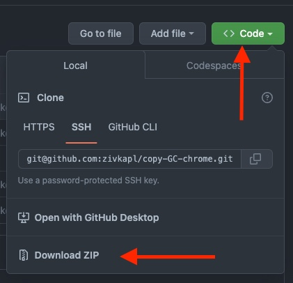

<br/>

#  🎟️ The easiest way copy your Jira issue ID!
The extensions add a "Copy ID" button for each ticket on your dashboard! 


<br/>

# 🛠 Installation

## 1️⃣ Download as zip and unzip

manually:



 or using the following script:

```bash
cd <CHOOSE FOLDER TO DOWNLOAD TO>
wget https://github.com/zivkapl/copy-GC-chrome/archive/refs/heads/main.zip -O copy-GC-chrome.zip
tar -xmvf copy-GC-chrome.zip
```
<br/>

## 2️⃣ Load to Google Chrome

-   open Chrome and go to `chrome://extensions/`
-   Activate `Developer mode` on the top right corner
-   click `Load unpacked` and select the unzipped directory (`copy-GC-chrome-main`)
